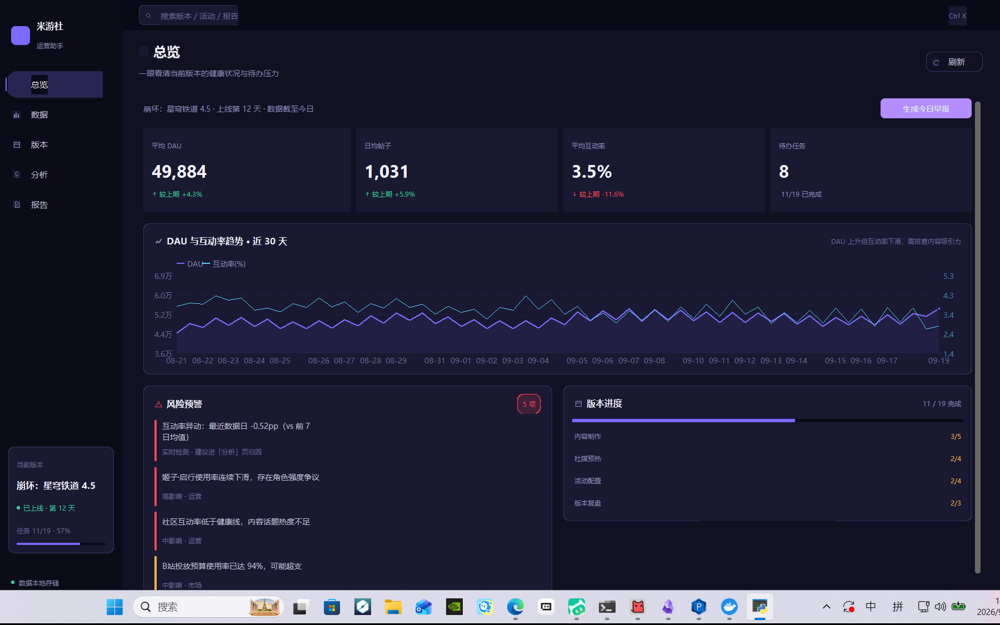
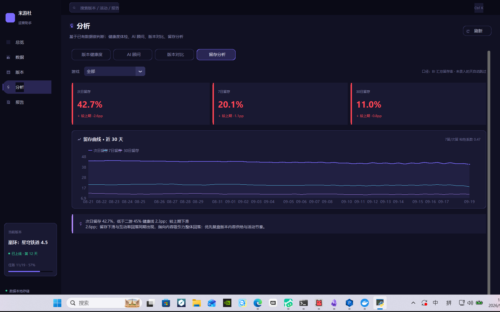
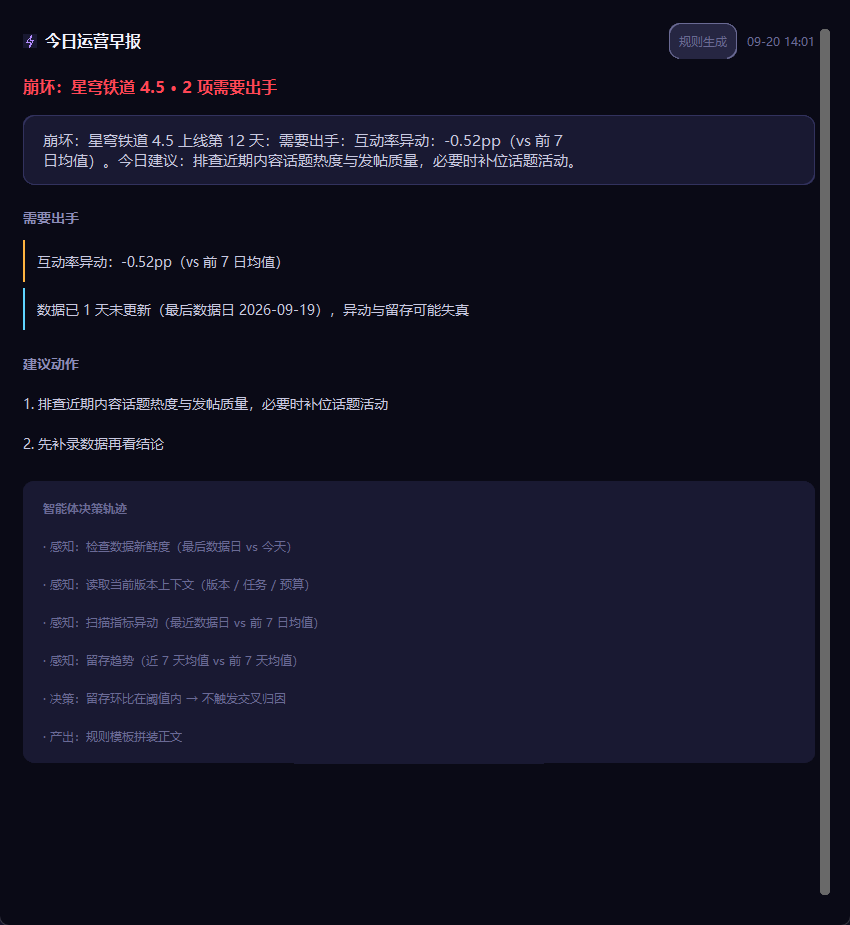
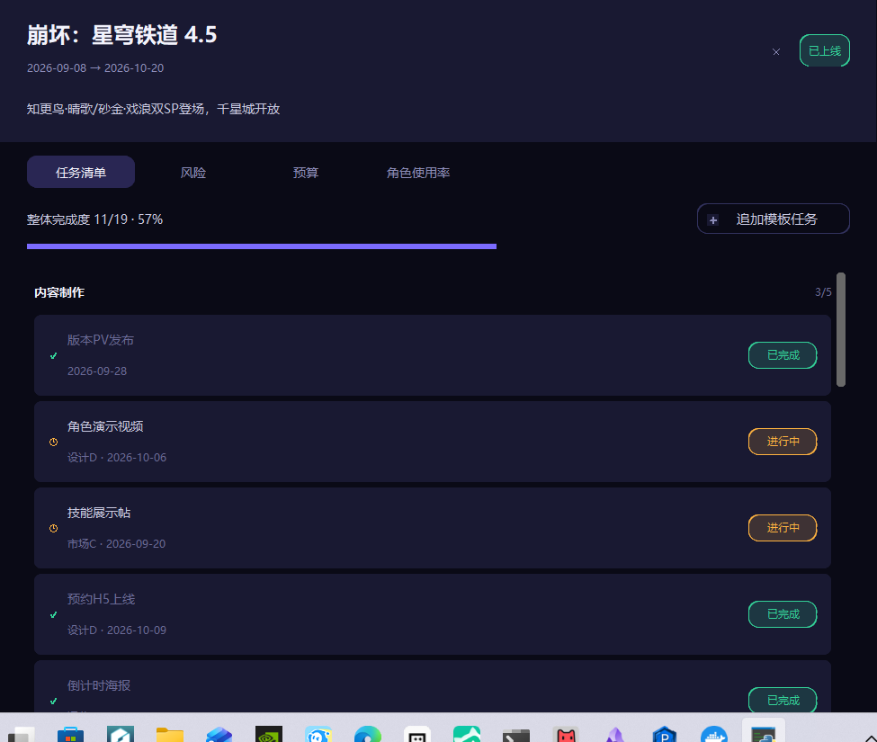

# 米游社运营助手 (miHoYo Community Ops Tool) v4.2

<div align="center">

[简体中文](README.md) | [English](README_EN.md)

[](https://github.com/YHR-hub/community-ops-tool/actions/workflows/ci.yml)


**[⬇ 下载 exe（Windows，免安装）](https://github.com/YHR-hub/community-ops-tool/releases/latest)**

</div>

游戏社区运营全流程管理桌面工具，面向米哈游系产品（原神 · 崩铁 · 绝区零 · 崩坏3）的日常运营工作。

> **v4.2 是早报智能体版**：在 v4.1 数据能力（留存分析 + 异动归因）之上，
> 新增**早报智能体**——感知 → 决策 → 产出的可解释智能体，一键把今天的晨会开了。
> v4.1 补数据运营核心能力，v4.0 完成「星空琉璃」视觉换装，v3.1 重做设计系统与信息架构。

## 快速看效果

| 总览 · 异动预警自动浮上来 | 分析 · 留存分析 |
|---|---|
|  |  |

| 早报智能体 · 感知-决策-产出 | 版本 · 详情抽屉 |
|---|---|
|  |  |

更多截图见 `shots/`（14 张全覆盖）。3 分钟演示动线见 `DEMO_SCRIPT.md`，
完整演进过程（每版为什么做、怎么验收的）见 `迭代记录.md`。

## 功能模块

五个主导航，一个能力只有一个入口。

| 模块 | 功能 |
|------|------|
| 总览 | 指标卡（含环比）、DAU/互动率双轴趋势 + 人话解读、风险预警（人工记录 + **实时异动检测**）、版本进度、**一键生成今日早报（智能体）** |
| 数据 | 每日指标录入（重复录入会确认覆盖、留存率上限校验）、CSV 导入导出、角色使用率、社区平台热度 |
| 版本 | 状态看板 / 甘特时间线 / 版本详情抽屉（任务 · 风险 · 预算 · 角色使用率） |
| 分析 | 版本健康度四维体检、AI 运营顾问（7 场景）、两版本全指标对比、**留存分析（曲线 + 健康线 + 交叉归因）** |
| 报告 | 四段式智能报告、周期报表（周报/月报/季报，可导 CSV）、历史归档可查看可删除 |

## 技术栈

- **GUI**：Python 3.11 + CustomTkinter（原生桌面，非 Electron）
- **数据**：SQLite（WAL 模式 + busy_timeout + 13 索引 + 4 唯一约束）
- **AI**：DeepSeek / OpenAI 兼容接口，后台线程异步调用，未配 Key 时自动降级为离线建议
- **可视化**：tkinter Canvas 自绘，宽度自适应，零外部依赖（含 33 个矢量图标）
- **打包**：PyInstaller 单文件

## 设计与架构要点

**视觉：五级明度阶梯**
旧版所有卡片同色，所以看起来平、素、没有主次。新版把背景分成
`#0A0A14 → #12121F → #1A1A2E → #24243A → #32324E` 五级，
越靠前的元素越亮，层级自然浮现；再配左侧色条强调卡把异常项从同色卡片中拎出来。

**图标：手绘矢量**
33 个图标用 Canvas 指令元组定义（`line` / `poly` / `rect` / `oval` / `arc`），
不依赖 emoji 或图标字体，可任意缩放换色。已通过 33 图标 × 3 尺寸 × 3 颜色 = 297 组合验证。

**架构：Mixin 不继承，状态收敛**
旧版 5 个 Mixin 全部继承 `ctk.CTk`，主流程里出现 `hasattr(self, 'ai_result')` 这类探测 ——
模块间没有状态边界。新版 Mixin 为纯 Mixin，共享状态收敛到 `AppState`。

**数据库：按查询路径建索引，而不是宣称"无索引也很快"**
13 个普通索引 + 4 个唯一索引。唯一约束用 `CREATE UNIQUE INDEX IF NOT EXISTS` 单独建 ——
写在 `CREATE TABLE` 里的 `UNIQUE` 对已存在的老库不生效，
会让 `INSERT ... ON CONFLICT` 直接报错（这是 v3.1 实测踩到的坑）。

## 运行方式

### 快速使用
- 本机已打包：双击 `dist\米游社运营助手.exe`，无需安装 Python
- 源码运行：`pip install -r requirements.txt` 后 `python main.py`

### 开发运行
```bash
pip install customtkinter openai pillow
python main.py
```

### 生成演示数据
首次打开数据库是空的。想立刻看到完整效果：

```bash
python seed_demo.py           # 数据为空时填充
python seed_demo.py --force   # 清空后重新生成
python seed_demo.py --reset   # 清空全部业务数据
```

生成的演示数据包含 3 个版本、105 天指标（内置一段互动率下滑趋势）、
38 项任务、7 项预算、4 条风险、28 条角色使用率与 10 条社区热度 ——
足以触发健康度评分、自动风险标记、报告结论等全部功能。

### 自测
```bash
python smoke_test.py   # 40 项：页面渲染 + 弹窗 + 核心逻辑 + 布局不变量 + 留存/异动/智能体
python flow_test.py    # 34 项：录入/导入/切换/标记/报告/早报 完整流程
python capture.py      # 14 张截图，用于肉眼验收（画面被遮挡时会跳过而非存错图）
```

### 自行打包
```bash
pyinstaller --onefile --noconsole --name "米游社运营助手" \
  --icon "icon.ico" \
  --hidden-import "openai" --hidden-import "customtkinter" --hidden-import "PIL" \
  --collect-data "customtkinter" --collect-submodules "customtkinter" \
  --exclude-module torch --exclude-module torchaudio --exclude-module torchvision \
  --exclude-module scipy --exclude-module matplotlib --exclude-module pandas \
  main.py
```

两个打包实测坑（都已绕过，换环境重新打包时注意）：

- **exclude torch 系是必须的**：本机 site-packages 装过 torch/torchaudio（数 GB），
  `openai` 的依赖分析会连带把它们拉进打包图，Analysis 阶段收集 CUDA 动态库
  直接卡死（实测两次 10+ 分钟零产出）。排除后打包约 3 分钟。
- **不要 `--collect-all`**：它会扫描二进制文件，速度慢一个量级；
  customtkinter 只需要 `--collect-data`（字体/图片资源）+ `--collect-submodules`。
- **数据库落点已处理**：`db._db_path()` 在 frozen 模式下落到 exe 旁的 `data/`
  （onefile 的 `__file__` 指向临时解包目录，不处理的话用户数据重启即丢）。
  exe 首次启动是空库，打开总览页点「载入演示数据」即可完整演示。

## 项目结构

```
运营助手/
├── main.py                  # 入口 + App 容器 + 侧边栏 + 命令面板
├── agent.py                 # 早报智能体：感知 → 决策 → 产出（含 trace 决策轨迹）
├── theme.py                 # 设计系统：明度阶梯 / 语义色 / 字体 / 间距
├── components.py            # 通用组件：Card / StatCard / Badge / EmptyState ...
├── icons.py                 # 33 个 Canvas 矢量图标
├── charts.py                # 自适应图表：Line / Bar / Gantt / ProgressBar
├── db.py                    # 数据层：schema / 索引 / 业务查询 / 输入校验
├── seed_demo.py             # 演示数据生成（对齐 4.5 版本）
├── smoke_test.py            # 渲染冒烟测试（含布局不变量）
├── flow_test.py             # 业务流程测试
├── capture.py               # 截图验收脚本
├── DEMO_SCRIPT.md           # 3 分钟面试演示逐字稿
├── 迭代记录.md               # v2.x → v4.2 演进全记录
├── shots/                   # 14 张验收截图（README 引用）
├── views/
│   ├── __init__.py
│   ├── overview.py          # 总览
│   ├── data.py              # 数据
│   ├── versions.py          # 版本
│   ├── analysis.py          # 分析
│   └── report.py            # 报告
├── _legacy/                 # v2.x 旧视图（已废弃，留档参考）
├── data/                    # SQLite 数据库（自动创建）
└── icon.ico
```

快捷键：`Ctrl+1~5` 切模块 · `Ctrl+K` 全局搜索 · `Ctrl+S` 上下文保存

## v4.2 早报智能体：感知 → 决策 → 产出

这一版回答一个问题：**会不会用 AI 做运营？AI 的判断边界放在哪？**
v4.1 之前，工具里的 AI 只扮演「顾问」（AI 问答、AI 润色报告）；v4.2 落地了一个
真正干活的智能体——总览页一键生成「今日早报」，替运营把晨会开了。

### 三段式架构（`agent.py`，独立模块不耦合 UI）

1. **感知层**：四类状态探针——数据新鲜度（最新数据日距今几天）、
   留存下滑（当日 vs 前值越线）、留存×互动率交叉验证、逾期任务数、预算水位。
   阈值**复用数据层同一套常量**（`ANOMALY_RULES` / `valid_retention`），
   智能体说的「留存崩了」和数据层是同一句话，不另立口径。
2. **决策层**：确定性规则路由。留存下滑才去交叉查互动率，
   按交叉结果归因（互动率同步走低 → 内容吸引力回落；平稳 → 新增渠道质量波动）；
   每条异动映射到具体动作（如 DAU 异动 → 拆游戏维度看贡献）。
3. **产出层**：headline + 分级预警（danger/warn/info）+ 建议动作 + **决策轨迹 trace**。

### 两个口径决定（面试可讲）

- **规则管「对不对」，LLM 管「好不好听」**：数据判断交给 LLM 不可复现也不可审计；
  LLM 只做表达润色（配 Key 才启用），失败自动回退规则模板——没 Key、断网、超时都不出错报。
- **trace 是一等功能**：运营 AI 不可解释就没法信。每次生成留痕
  「感知到什么 → 为什么查交叉指标 → 查到什么 → 归因到哪」，UI 折叠区直接可见。

### 演示数据对齐 4.5

角色池 / 版本号 / 事件 / 风险标题全部更新到当前真实版本 4.5「挥掷千星的筹码」
（知更鸟·晴歌 / 砂金·戏浪双SP，复刻风堇 / 不死途，千星城开放）。seed 角色名单被测试断言引用，
改名连测试一起改，保证演示数据与断言一致。

测试基线 70 → **74 项**（smoke 40 + flow 34），新增智能体全链路结构、
确定性造数异常捕获、纯函数归因分派（留存×互动率四种组合）与抽屉渲染用例；
截图 13 → 14 张（新增 11_早报智能体）。

## v4.1 数据能力升级：留存分析 + 异动归因

这一版回答一个问题：**作为数据运营方向的候选作品，它懂不懂「数」？**
之前的功能偏「流程管理」（任务、排期、报告），缺了数据运营的看家指标。

### 留存分析（分析页第 4 个 Tab）

- **数据模型**：`daily_metrics` 增加 `new_users` 与 `retention_1/7/30` 四列，
  存 BI 汇总口径的当日留存率（不是用户级 Cohort——运营工具通常拿不到明细，
  汇总口径足够支撑趋势判断与健康线对比）。老库用 ALTER TABLE 幂等迁移，
  迁移后的 0 值视为「未统计」，绘图与统计一律过滤，避免曲线砸到 0 再跳回 45 的假象。
- **三个可视化**：留存三卡（均值 + 环比 + 健康线强调）、三线留存曲线（次留/7留/30留，
  复用折线图组件）、7留/次留粘性系数提示。
- **两个口径决定**（面试可讲）：
  - 环比用 **pp（百分点差）** 而不是百分比变化——留存率已是比例，
    再做一次百分比变化会把 45→40 放大成 -11%，制造情绪数字；
  - 健康线 45%（二游经验值）只作为「低于就查原因」的触发器，卡片变红，不当真理。

### 异动归因（总览页风险预警自动浮出）

- `db.anomaly_report()`：最近一个数据日 vs 前 7 日均值。
  两个口径决定：锚定「最近有数据的一天」而不是今天（今天没录数时按日历算全是假异动）；
  基准用 7 日均值而不是前一日（周三比周日跌 20% 多半是周内节律，不是异动）。
- 阈值常量表：DAU ±10%、新增用户 ±12%、互动率 ±0.5pp；DAU/新增用百分比、
  互动率用 pp，量纲不同规则不同。
- **游戏维度拆分**：多游戏库的 DAU 异动自动拆到每个游戏的贡献
  （「拆分：星铁（拖累 18%）」），只统计当日有数据的游戏——
  今天没录数的游戏 cur=0，直接算会被误判成 -100% 拖累（实测踩到后修掉）。
- 风险预警卡分「人工记录」与「实时检测」两层；**上涨不进风险卡**——
  暴涨是机会不是风险，风险卡只收需要出手的事。

### 顺带修掉的两个真 bug

| 问题 | 触发方式 | 修复 |
|------|----------|------|
| StatCard 的 delta 直接二元组解包，纯文字形态（"11/19 已完成"）会 ValueError | v3.1 起潜伏，演示数据随机序列一变就炸 | 按类型分派：tuple 解包 / 字符串原样展示 / None |
| `_insert_metric` 用 `rec[]` 下标取值，部分字段的记录 KeyError 被 except 吞掉，覆盖变假成功 | flow_test 的部分字段用例 | 改 `rec.get(k, 0)`，缺省字段按 0 落库 |

测试基线从 61 项扩到 **70 项**（smoke 37 + flow 33），新增留存数据层、
留存上限校验、异动检测确定性用例（不依赖演示数据的随机性）与多游戏拆分定位。

## v4.0 换装说明

### 换装流程：先看方案，再动代码

没有直接上手改，而是先用真实布局渲染了三套完整配色方案对比（星空琉璃 / 霓虹赛博 / 星穹金曜），
确认方向后才落地。同时明确了一个技术边界并如实告知：**Tk 不支持渐变、半透明、毛玻璃、发光描边**
（CustomTkinter 不接受 `#RRGGBBAA`），所以做到的不是贴图的「皮肤」，而是游戏感的骨架——
深色冷调阶梯、大圆角、胶囊导航、分色语义。

### 关键工程动作：PRIMARY / DANGER 语义拆分

v3.1 的 `PRIMARY = "#FF4D6A"` 同时承担「品牌主色」和「警戒红」两个语义。
这意味着直接换主色会让高风险标签、逾期提示、预算超支、错误 toast、行情涨幅**全部变紫**——
换装换到一半就会崩掉语义。所以 v4.0 的第一步是拆：

| 色 | 值 | 承担语义 |
|----|----|----------|
| `PRIMARY` | `#7B6BFF` 星轨紫 | 按钮 / 导航 / 进度条 / DAU 折线 / 选中态 |
| `DANGER` | `#FF4655` 警戒红 | 高风险 / 逾期 / 预算超支 / 行情涨红 / 错误 toast |

随后 grep 审计全部用法，把 5 个视图文件里 **45 处**危险语义的 `PRIMARY` 按行号批量替换为 `DANGER`
（从后往前替换避免行号漂移），品牌语义的用法保持不动；`components.py` 的 StatCard
同一步明确了运营指标「涨绿跌红」与行情「涨红跌绿」的语义分野。
兼容层 `MHY_RED` 指向 `DANGER`，旧引用不炸。

### 界面变化

- **导航胶囊化**：侧边栏选中态从 7px 小圆角矩形改为胶囊形（`corner_radius = 高度/2`），
  选中项背景淡紫底 + 白字 + 亮图标；图标是 Canvas 画布不能直接改色，
  切换时销毁重建（`icons.draw_icon`）。
- **明度阶梯整体偏蓝紫**：七级 `#07070F → #32325E`，层级反差比 v3.1 更大。
- **圆角加大**：`RADIUS_MD 8→10`、`RADIUS_LG 10→14`。
- **AI 功能独立色**：`AI = #B48CFF`，与品牌紫区分但同族。

### 回归验证

61 项测试全绿（smoke 30 + flow 31，含布局不变量），12 张截图逐页肉眼验收
（风险红、超支红、逾期红在紫底上均清晰可辨，无语义混淆）。

## v3.1 改了什么

### 修复的数据正确性缺陷

| 问题 | 后果 | 修复 |
|------|------|------|
| 重复录入同一天同一游戏直接 INSERT | DAU 翻倍，图表出现不可能的跳变 | 先查重，弹确认框让用户选覆盖/跳过 |
| `get_versions()` 跨游戏全局排序后 `index()+1` 取上一版本 | **「星铁 3.6 的上一版本」被算成「原神 5.2」**，角色使用率对比 JOIN 出 0 行，自动风险标记静默失效 | 新增 `previous_version()`，先按 game 过滤再取相邻版本 |
| `_auto_mark_risks` 取 `entries[i][1]`（数值列）当角色名 | 生成 `%!s(float=52.3)` 这类垃圾风险标题 | 改取 `entries[i][0]`，并复现验证能抓到 2 个下滑角色 |
| `CREATE TABLE` 里的 `UNIQUE` 对老库不生效 | CSV 导入 `ON CONFLICT` 直接报错 | 拆出 `ensure_unique_indexes()`，先清重再建唯一索引 |
| 全局搜索 LIKE 未转义 `%` `_` | 搜一个 `%` 全表命中 | 加 `ESCAPE '\'` 并转义通配符 |
| `_gen_smart_report` 后半段覆盖前半段 | 「智能报告」永远只出周报，四段式是死代码 | 拆成两个独立 Tab，互不覆盖 |
| 裸 `int()` 转换用户输入 | 输错一个字就崩 | `safe_int` / `safe_float` + 逐字段校验报错 |
| 多个 `except: pass` | 保存失败却提示成功 | 写入层改为失败即抛出并提示 |

### 修复的界面缺陷

这一轮的重点是「能跑通」不等于「看着像成品」。以下都是把界面真正截下来逐张看之后才发现的。

| 问题 | 表现 | 修复 |
|------|------|------|
| **空 `CTkFrame` 保留 250px 默认高度** | 版本卡里一大片空白（5.2 卡片凭空高出 214px） | 抽出 `components.vbox/hbox/Row`，透明容器一律显式 `height=1`，全项目统一 113 处 |
| **左侧色条不给 `height` + `pack_propagate(False)`** | 色条被 `fill="y"` 拉成一条 250px 长竖线，整行跟着变高 | 色条固定 `height=34`；新增 `components.Row` 把「色条 + 文本」结构收敛到一处 |
| **双列网格用 `sticky="nsew"`** | 内容少的卡片被同行高卡拉伸，文字浮在中间 | 改 `sticky="new"` + `grid_rowconfigure(weight=0)`，卡片按内容高度收缩 |
| **折线图直接画原始日频数据** | 30 个点的锯齿墙，两条双轴线互相穿插成一团噪声 | 新增 `moving_average()` 做**展示层**平滑（计算仍用原始值）；填充透明度降到 0.08；主/副指标分线宽 2 / 1.4；填充与折线分两遍绘制 |
| **X 轴刻度按 `cw//44` 取整跳格** | 出现 `09-04 09-05 09-07 09-08` 这种疏密不均的刻度 | 改为等间隔抽稀 + 末点强制补齐 |
| **滚动容器末位卡片吸收剩余高度** | 页面最后一张卡片被纵向拉长 | `page_scaffold` 预先 `side="bottom"` 占位一个空帧兜住多余空间 |
| 截图脚本无遮挡校验 | 抓到别人窗口的画面还存成「验收图」 | 加亮度判定，画面不属于本应用时跳过并明确报出 |

对应的回归防护写进了 `smoke_test.py` 第 10 节「布局不变量」——
断言「不存在高度接近 250px 的空帧」「卡片高度不超过宽度的 0.9 倍」「列表行高不超过 120px」。
故意把 `Row` 的色条 `height` 去掉后，这三条会立刻失败（`[250, 250, 250, 250]`）。

### 其他修复

- `versions.py` 用了 `Canvas` 却没 import（版本带"使用率"风险项时必崩）
- 图表 `w = 700` / `bar_width = 680` 硬编码（换分辨率就崩）→ 全部改为 `<Configure>` 自适应
- AI 客户端 `timeout=10`（长回答必被截断）→ 放宽到 45s
- `AppState` 挂在 `self.state` 会覆盖 Tk 自带的 `state()` 方法，
  导致 CustomTkinter 的 DPI 追踪器抛 `'AppState' object is not callable`，
  界面停在初始状态 → 改挂 `self.app_state`
- 侧边栏「当前版本」卡片只有一行 `v2.0 · SQLite` → 改为显示版本名、状态、上线天数、任务进度条

### 信息架构调整

- 排期 / 预算 / 风险 原本在「版本管理」Tab 和独立页面两处重复出现 → 统一收进版本详情抽屉
- AI 顾问、健康度、版本对比 分散在三处 → 合并进「分析」
- 全局搜索从侧边栏底部 → 提到顶部命令栏（Ctrl+K）

## 适用场景

游戏社区运营岗的日常工具箱，适合作为职业作品展示：

- 运营实习 / 校招简历附作品链接
- 面试演示：载入演示数据 → 看总览 → 进版本详情 → 跑健康度体检 → 生成报告
- 入职后直接当生产力工具使用
